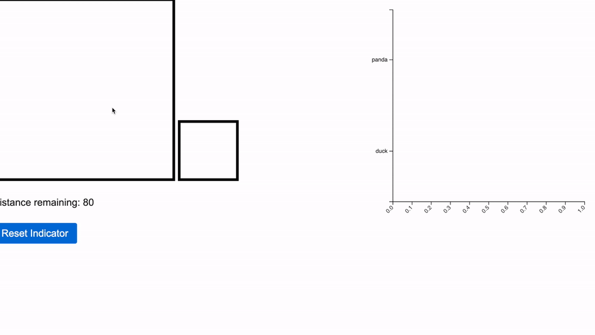

# Competitive-Drawing
A game where players compete to draw differing prompts on a shared canvas, as judged by a computer vision model

TODO
* train model
    * retrain with more classes
    * try sgd optimizer
* ai opponent
    * two losses: discriminator/stroke loss and prediction score loss
    * MCTS self-play
* game mechanics
    * switch to stroke-based system, not pixels
    * multiplayer sockets
    * distance limits slowly get smaller
    * hide opponent target
    * erasing turn for loser if winning by more than 30%
        * the loser always has hope, the winner has to continue to draw to avoid relying on one feature
    * cheat detection
    * optional coloring for opponent vs your strokes
    * target selector for local play
* better ui
    * canvas on left
    * preview bottom right
    * plot to top right on top of preview
        * rotate vertically
        * in competitive mode, show confidence as a single bar below canvas
    * only show relevant classes
        * me is on left, opponent is on right
    * clear canvas button in free draw mode
* bug fixing
    * update on window resize
    * top left logo pencil color should be blue
