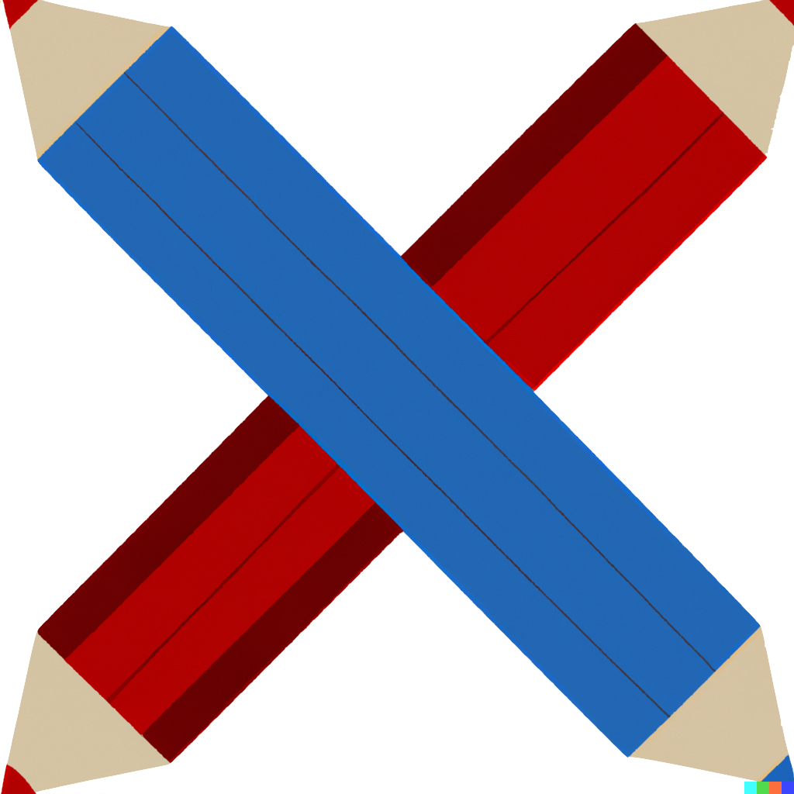

# Competitive-Drawing
A game where players compete to draw differing prompts on a shared canvas, as judged by a computer vision model

TODO
* name?
* train model
    * investigate exactly how data was created so we can match
    * retrain with more classes
    * sdg optimizer
* ai opponent
    * stroke loss?
    * static gradient descent with a few random initializations
    * gan
    * self-play reinforcement learning
* server side inference
    * at the end mouse out to validate data and correct results
* game mechanics
    * multiplayer sockets
    * distance limits slowly get smaller
    * hide opponent target
    * erasing turn for loser if winning by more than 30%
        * the loser always has hope, the winner has to continue to draw to avoid relying on one feature
    * cheat detection
    * grad cam
    * optional coloring for opponent vs your strokes
* better ui
    * canvas on left
    * preview bottom right
    * plot to top right on top of preview
        * rotate vertically, show percentages at top of bars
    * only show relevant classes
        * me is on left, opponent is on right
    * clear canvas button
* bug fixing
    * update on resize
        * stroke length
        * mouse distance
    * code cleanup, split up javascript files
    * top left logo pencil color should be blue
    * download libraries locally?
