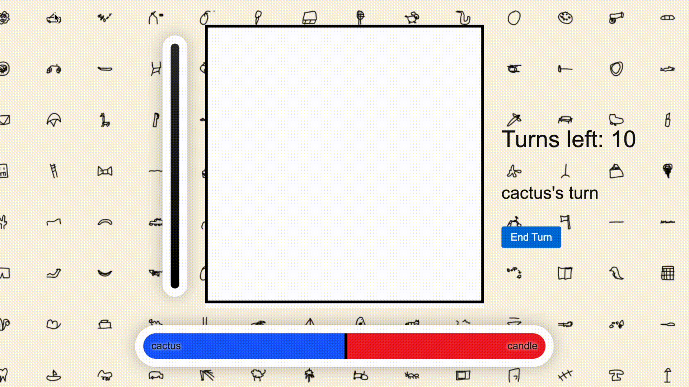

# What if Drawing was a Competition?
Competitive Drawing is a game where players compete to draw two different prompts on the same shared canvas. The winner is determined by a neural network trained on Google's [Quickdraw Dataset](https://quickdraw.withgoogle.com/data).

You can now visit a demo of this game at [competitivedrawing.com](https://competitivedrawing.com).

<p align="center">

</p>

## Set-up ##
Clone repository
```bash
git clone https://github.com/kylesayrs/Competitive-Drawing.git
```

Install package using pip. Note that if you want to train models, not all dependencies have been listed here
```bash
python -m pip install -e .
```

Launch web api and model service. Settings such as host and ports can be adjusted in `src/competitive_drawing/settings.py`
```bash
competitive_drawing.launch_web_app
competitive_drawing.launch_model_service
```

## Zero-Shot Learning ##
A significant challenge of training a model for this game is that the model will be predicting on images which are a combination of two separate classes. The Quickdraw Dataset however, only contains samples of one class at a time. A model trained on the Quickdraw Dataset performed great during training and evaluation, but was found to be unpredictable and wildly overconfident when applied to the kinds of images generated by users drawing two prompts at once. This is because the "franken" images produced at test time do not resemble those the model was trained on.

### Cutmix/mixup Augmentations ###
In order to emulate the "franken" images like those found during normal game play, I use cutmix and mixup image augmentations. These augmentations mix portions of each of each class in the same way two humans might mix features from each of their classes when drawing together. Using these augmentations significantly improved model stability and help give certainty that the model will not behave unexpectedly during test time.


</p>

### Logitnorm ###
In a recent paper, authors [Hongxin Wei et al.](https://arxiv.org/abs/2205.09310) describe a method of reducing model overconfidence called Logit Normalization. This method treats the logits (model outputs before the softmax layer) as vector which they then normalize before calculating cross entropy loss. The effect of normalizing the logits is that the model no longer optimizes the magnitude of the logits and is therefore more likely to produce more conservative output when fed out-of-distribution data.


</p>


## Differentiable Graphics for AI Opponent ##
My work for the AI opponent builds upon [Tzu-Mao Li 2020 "Differentiable Vector Graphics Rasterization for Editing and Learning"](https://people.csail.mit.edu/tzumao/diffvg/). My purpose is to build an AI opponent that draws a curve on the given canvas that optimizes the AI's score while being constrained by the borders of the image and a maximum curve length.

### Problem Statement ###
I want to build an AI that, given a base image, produces changes to that image that increase its score with respect to a classifier. A straight-forward attempt to build a model that can do this might involve encoding the original image and producing a learned image that, when added to the original image, produces a high score from the classifier. However, previous work by [Dawei Zhou et al.](https://arxiv.org/abs/2109.09901) has shown that this kind of architecture produces masks that better resemble random noise rather than deliberate, discrete strokes like you'd expect from a human.

My approach is to learn a curve which resembles an actual human pen stroke while still increasing the AI's score. While this method will not produce scores that are higher than adversarial noise, it will produce a AI opponent that is both challenging and fun to play against.

### Bézier Curve Differentiation ###
Curves, unlike individual pixels values, are not obviously differentiable. To make curves differentiable with respect to the raster images that they produce, we can take advantage of an existing graphics technique called anti-aliasing which adds blur around a line. This technique produces grey pixel values which are much more differentiable than binary pixel values.

In order to implement anti-aliasing of a vector curve, we must compute the shortest distance of each pixel to the curve in order to determine its brightness value. In the special case of a straight line, there is a closed form solution that involves projecting the point onto the line and computing the distance from that projection point to our original point.

<p align="center">

</p>

In the case of Bezier curves of degree greater than or equal 3, however, no closed form solution for the projection exists. This is noted by [Tzu-Mao et al.](https://people.csail.mit.edu/tzumao/diffvg/) The authors instead stochastically sample points along the line and compute the minimum distances from any of the sample points to our original point. To make this method more robust for my purposes, I instead sample points uniformly along the curve.

Again, there is no closed form solution to uniformly sample distances along a Bézier curve, so I use a linear approximation with a couple points.

### Optimization Results ###
| Successes | Drawbacks |
| --- | ----------- |
| <p align="center"><p align="center">Example of the curve optimizing to a target image in blue</p></p> | <p align="center"><p align="center">Like any gradient descent algorithm, there exist local minima</p></p> |
| <p align="center"><p align="center">The curve is capable of disentangling itself</p></p> | <p align="center"><p align="center">Local minima often exist at the edges</p></p> |

Because of these local minimums and limits to how wide I can make the strokes before they become out of domain for the classifier, I search for the best stroke by optimizing multiple curves from different initial positions on the image and then taking the stroke with the lowest loss.

### Constraints and Curve Truncation ###
I enforce two constraints on my optimized curve.

The first is that the endpoints must stay on the canvas. This prevents situations such as the curve moving entirely off screen and thus producing no gradient to optimize.

The second is that the curve's arc length must not exceed a maximum length. As mentioned previously, the curve's length is estimated using a couple of points. I then compute a [subdivision](https://pages.mtu.edu/~shene/COURSES/cs3621/NOTES/spline/Bezier/bezier-sub.html) that satisfies my constraint using Casteljau's algorithm for computing Bézier curves.

<p align="center">

</p>

Both of these constraints are non-differentiable, so I enforce them after each optimization step. In the future I hope to find an algorithm that can find any portion of the curve that is not on the canvas and will adjust the curve accordingly, not just the endpoints.

### Related Repos ###
These repos are used for research and other side tasks
* [Differentiable-Graphics](https://github.com/kylesayrs/Differentiable-Graphics)
* [SketchGeneration](https://github.com/kylesayrs/SketchGeneration)
* [SketchCNN-AE](https://github.com/kylesayrs/SketchCNN-AE)
* [GMMPytorch](https://github.com/kylesayrs/GMMPytorch)
* [GMMScratch](https://github.com/kylesayrs/GMMScratch)

## Development Board ##
https://kahl.notion.site/90a75c8cbbbe4eb1924d24e61818d2d2?v=9aeff125dd33457da8f046c1715c206a
