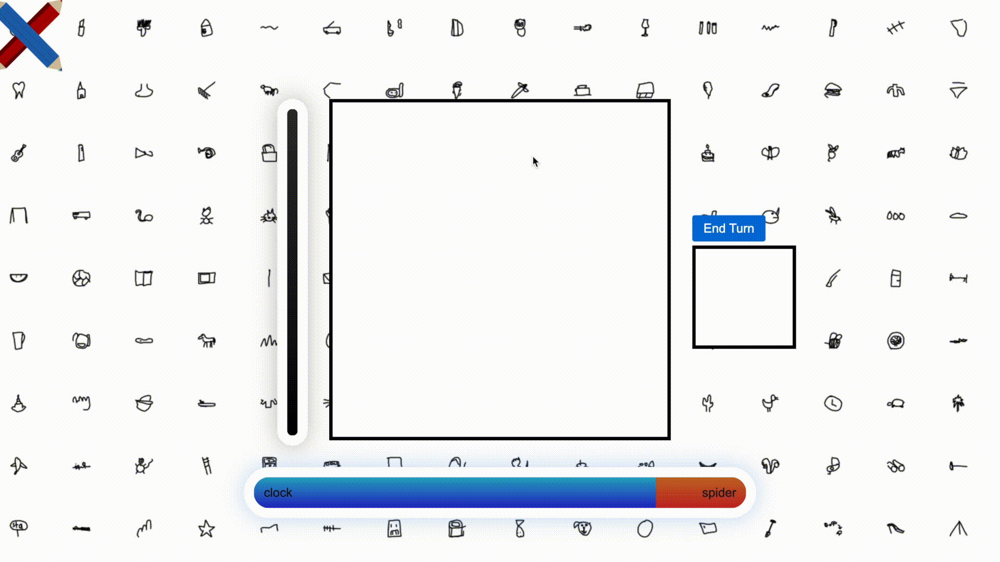
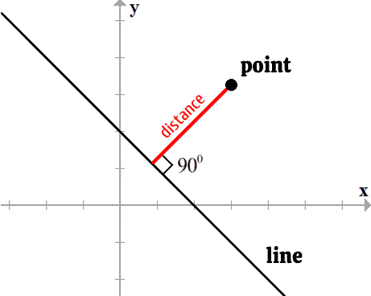
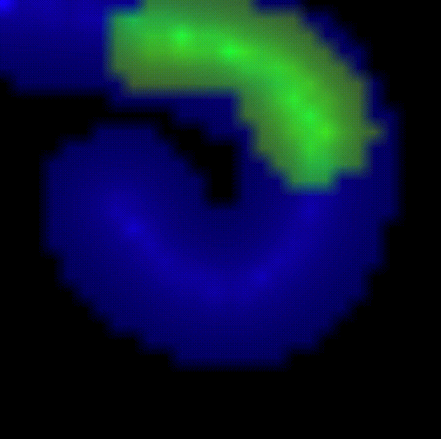
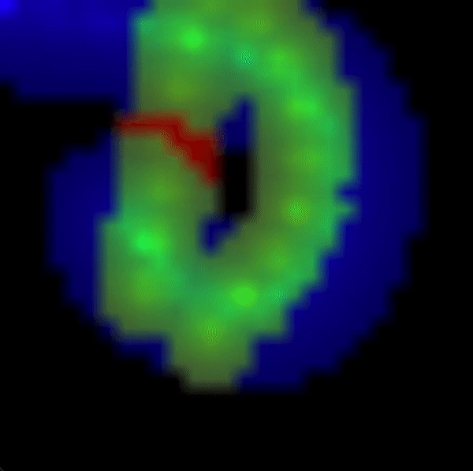
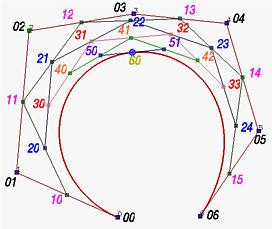

# TrickDraw
A game where players compete to draw differing prompts on a shared canvas, as judged by a computer vision model

<p align="center">

</p>

## Set up ##
Clone repository
```bash
git clone https://github.com/kylesayrs/drawnt.git
```

Install package using pip. Note that not all requirements have yet been added as dependencies
```bash
python -m pip install -e .
```

Launch web api and model service. Settings such as host and ports can be adjusted in drawnt/src/drawnt/settings.py
```bash
drawnt.launch_web_app
drawnt.launch_model_service
```

## Differentiable Graphics for AI Opponent ##
This work builds upon [Tzu-Mao Li 2020 "Differentiable Vector Graphics Rasterization for Editing and Learning"](https://people.csail.mit.edu/tzumao/diffvg/). My purpose is to build an AI opponent that draws a curve on the given canvas that optimizes the AI's score while being constrained by the borders of the image and a maximum curve length.

### Problem Statement ###
Fundamentally, I want to building an AI that, given a base image, produces changes that increase its score as judged by a classifier. A naive attempt to build a model that can do this might involve encoding the original image and producing a learned mask that, when added to the original image, produces a high score from the classifier. However, previous work by [Dawei Zhou et al.](https://arxiv.org/abs/2109.09901) has shown that this kind of architecture produces masks that better resemble random noise rather than deliberate, discrete strokes like you'd expect from a human.

My approach is to learn a curve which resembles an actual human pen stroke while still increasing the AI's score. While this method will not produce scores that are higher than pixel perfect adversarial noise, it will produce a AI opponent that is both challenging and fun to play against.

### Bézier Curve Differentiation ###
Curves, unlike individual pixels values, are not obviously differentiable. To make curves differentiable, we can take advantage of an existing graphics technique called anti-aliasing which essentially adds blur around a line which is both pleasing to the eye and much more differentiable than binary valued pixels.

In order to implement anti-aliasing of a vector curve, we must compute the shortest distance of each pixel to the curve in order to determine its brightness value. In the special case of a straight line, there is a closed form solution that involves projecting the point onto the line and computing the distance from that projection point to our original point.

<p align="center">

</p>

In the case of Bezier curves however, no closed form solution for projection exists. This is noted by [Tzu-Mao et al.](https://people.csail.mit.edu/tzumao/diffvg/) The authors instead stochastically sample points along the line and compute the minimum distances from any of the sample points to our original point. To make this method more robust for my purposes, I instead sample points uniformly along the curve.

Again, there is no closed form solution to uniformly sample distances along a Bézier curve, so I use a linear approximation with a couple points.

### Optimization Results ###
| Good | Bad |
| --- | ----------- |
| <p align="center"><p align="center">Example of the curve optimizing to a target image in blue</p></p> | <p align="center"><p align="center">Like any gradient descent algorithm, there exist local minima</p></p> |
| <p align="center"><p align="center">The curve is capable of disentangling itself</p></p> | <p align="center"><p align="center">Local minima often exist at the edges</p></p> |

### Constraints and Curve Truncation ###
I enforce two constraints on my optimized curve.

The first is that the endpoints must stay on the canvas. This prevents situations such as the curve moving entirely off screen and thus producing no gradient to optimize.

The second is that the curve's arc length must not exceed a maximum length. As mentioned previously, the curve's length is estimated using a couple of points. I then compute the a [subdivision](https://pages.mtu.edu/~shene/COURSES/cs3621/NOTES/spline/Bezier/bezier-sub.html) that satisfies my constraint using Casteljau's algorithm for computing Bézier curves.

<p align="center">

</p>

Both of these constraints are non-differentiable, so I enforce them after each optimization step. In the future I hope to find an algorithm that can find any portion of the curve that is not on the canvas and will adjust the curve accordingly, not just the endpoints.

### Todo Board ###
https://kahl.notion.site/90a75c8cbbbe4eb1924d24e61818d2d2?v=9aeff125dd33457da8f046c1715c206a
